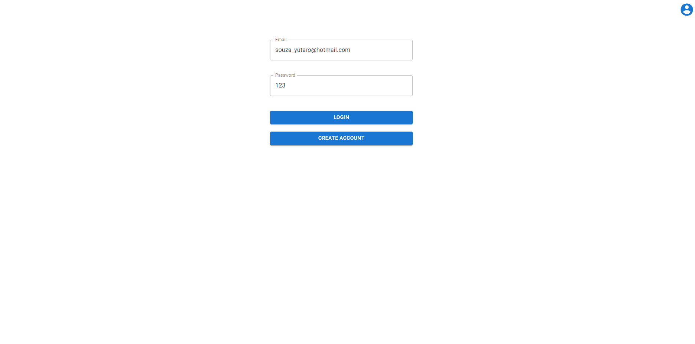

# README

Sistema de loja virtual para cafeteria criado com node, react e mongo

 
    <a href="#sobre">Sobre</a>
    <a href="#funcionalidades">Funcionalidades</a>
    <a href="#tecnologias">Tecnologias</a>
    <a href="#testar">Testar</a>
    <a href="#Autor">Autor</a>
     
 

 # Sobre
 

 
Sistema web de loja online com arquitetura rest, utlizando para o front: React e MUI, e no back é utilizado express com node.js    
 No sistema o usúario pode criar a sua conta, selecionar o que quer comer e finalizar a compra    
    
 Projeto com o foco em desenvolver um sistema com react, node, mongo, que utilize meus conhecimentos de frontend e backend

 
O site está 100% em inglês para treinar o meu desenvolvimento com projetos em inglês

 # Funcionalidades 
<ul>
    <li>Login com username</li>
    <li>100% responsivo</li>    
    <li>Sessão com JWT</li>
    <li>Criação de conta</li>
    <li>Encriptador de senhas com bcrypt</li>
    <li>Alterar informações da conta</li>
    <li>Adicionar items ao carrinho</li>
    <li>Finalizar compra</li>
 </ul>

 # Tecnologias
 <ul>
    <li>React</li>
    <li>MUI</li>
    <li>Node.js</li>
    <li>Express</li>
    <li>JWT</li>
    <li>Encriptador<li>
    <li>Javascript</li>
    <li>HTML</li>
    <li>CSS</li>
 </ul>

 
 # Como testar
 <ol>
    <li>É possivel testar projeto hospedado no <a href="https://mascarpone-coffee.herokuapp.com/">heroku</a></li>
    <li>Porém se quiser testar na sua máquina só seguir os próximos passos</li>
    <li>Abre o terminal de sua prefência</li>
    <li>git clone https://github.com/YutaroNegi/mascarpone-coffee</li>
    <li>cd papaya-chat</li>
    <li>npm i</li>
    <li>node index</li>
    <li>Abra o seu navegador e digite "http://localhost:5000"</li>
    <li>Pronto! só testar</li>
 </ol>

 # Autor

 <ul>
    <li>Yutaro Negi</li>
    <li><a href="https://www.linkedin.com/in/yutaronegi/">Linkedin</a></li>
    <li>(11) 94194-5061</li>
    <li>souza_yutaro@hotmail.com</li>
 </ul>

